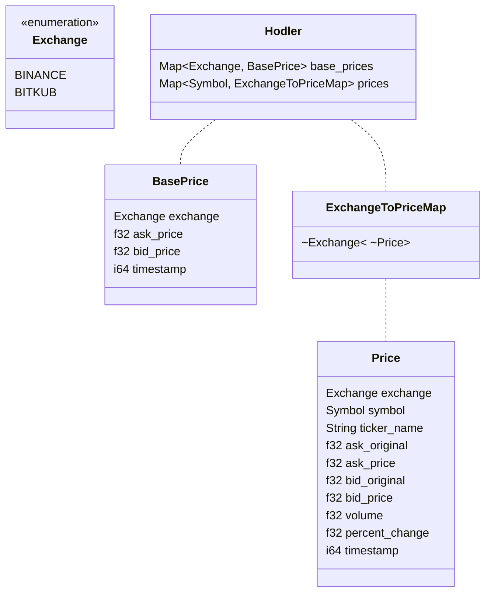

# Hodler Core

```mermaid
classDiagram
class Exchange {
  <<enumeration>>
  BINANCE
  BITKUB
}

class Hodler {
    Map~Exchange, BasePrice~ base_prices
    Map~Symbol, ExchangeToPriceMap~ prices
}

class BasePrice {
  Exchange exchange
  f32 ask_price
  f32 bid_price
  i64 timestamp
}

class ExchangeToPriceMap {
  ~Exchange~ ~Price~
}

class Price {
  Exchange exchange
  Symbol symbol
  String ticker_name
  f32 ask_original
  f32 ask_price
  f32 bid_original
  f32 bid_price
  f32 volume
  f32 percent_change
  i64 timestamp
}

Hodler..BasePrice
Hodler..ExchangeToPriceMap
ExchangeToPriceMap..Price
```
